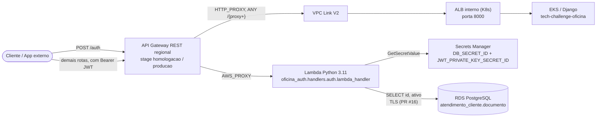

# Tech Challenge Oficina — Autenticação Serverless

Serviço serverless que autentica clientes da Oficina por CPF e emite um JWT RS256 de curta duração (`access_token`), sem representar o cliente como usuário Django. Entrega a Lambda Python, a API Gateway REST regional (`/auth` e `/{proxy+}`) e o Terraform específico dessa fronteira, e se apoia no VPC, subnets, NAT, EKS e ALB do repositório K8s e no RDS do repositório Database. O token emitido aqui é o que o [app principal](https://github.com/helyomendesdev/tech-challenge-oficina) valida em `atendimento/authentication.py` para autorizar rotas de cliente (por exemplo `GET /api/v1/veiculos/`).

Responsável técnico: Lucas Marques (`O-marqs`).

## Tecnologias

| Camada | Tecnologia |
|---|---|
| Linguagem / runtime | Python 3.11 (`requires-python = ">=3.11,<3.12"`, Lambda `runtime = "python3.11"`) |
| Driver PostgreSQL | `pg8000` 1.31.5 (DB-API puro Python, sem wheel nativo) |
| JWT | `PyJWT[crypto]` 2.13.0 + `cryptography` 50.0.1 (RS256) |
| AWS SDK | `boto3` 1.43.89 (Secrets Manager) |
| Empacotamento | `hatchling`, build reproduzível via `scripts/build_lambda.py` |
| Cômputo | AWS Lambda (Python 3.11, x86_64) |
| API | API Gateway REST regional + VPC Link V2 (`aws_apigatewayv2_vpc_link`) |
| Segredos | AWS Secrets Manager (credenciais de banco e chave privada JWT, em Secrets separados) |
| Infraestrutura como código | Terraform `>= 1.5.0`, provider `hashicorp/aws = 6.61.0`, backend S3 + DynamoDB lock |
| CI/CD | GitHub Actions (`.github/workflows/ci.yml`, `.github/workflows/cd.yml`) |
| Testes | `pytest` 8.x + `pytest-cov` (cobertura mínima 90% na CI), `ruff` para lint/format, `terraform test` |

## Arquitetura deste repositório



O `POST /auth` usa integração `AWS_PROXY` direta com a Lambda. As demais rotas (`ANY /{proxy+}`) usam integração `HTTP_PROXY` privada, via VPC Link V2, até o ALB interno do K8s (HTTP, porta `8000`), que expõe o Django. A rota explícita `/auth` tem precedência sobre `/{proxy+}`. Em `develop`, o proxy remove o stage do path com `request_templates` de override VTL; **o PR #16** troca isso por `uri = "${alb_uri}/{proxy}/"` com `request_parameters` (`integration.request.path.proxy`), porque `HTTP_PROXY` ignora `request_templates` e rejeita `*/*` como chave de content type.

Este repositório não cria VPC, subnets, NAT, EKS, ALB, RDS, IAM Role, Secret ou Secret Version — apenas a Lambda, a API Gateway, o VPC Link V2, os Security Groups próprios e as regras direcionadas aos Security Groups externos do RDS e do ALB (ver [`terraform/README.md`](terraform/README.md)).

## Núcleo de Autenticação

- Value object `CPF`, com normalização e validação de dígitos verificadores.
- Registro mínimo `AuthenticationRecord`, com `cliente_id` e `can_authenticate`.
- Ports `ClientRepository` e `TokenIssuer`.
- Caso de uso `AuthenticateClient`.
- Adapter `InMemoryClientRepository`, somente para testes e desenvolvimento local.
- Adapter `PostgresClientRepository`, para a tabela Django `atendimento_cliente`, consultando pela coluna `documento` (CPF com ou sem pontuação) e lendo apenas `id` e `ativo`, sempre com TLS (`ssl_context=True`, porque o RDS aplica `rds.force_ssl=1`).
- Providers de credenciais e chave privada via Secrets Manager, com cache temporário no processo aquecido.
- Emissor `Rs256TokenIssuer` e verificador `TokenVerifier`. Clientes inexistentes e clientes não elegíveis (`ativo=false`) retornam o mesmo erro genérico `401`; o núcleo nunca registra CPF, `Authorization`, tokens ou segredos.
- Handler `POST /auth` para API Gateway REST API com Lambda proxy integration.

## Contrato do `POST /auth`

Contrato completo em [`openapi/openapi.yaml`](openapi/openapi.yaml).

O handler em `oficina_auth.handlers.auth.lambda_handler` trata eventos REST API proxy, valida método, `Content-Type`, JSON, body base64, payload exato com `cpf`, correlação e logs JSON seguros para stdout/CloudWatch/New Relic.

Para testes e demonstração local, use `create_local_demo_handler(...)` com dependências explícitas. A `lambda_handler` de produção exige `DB_HOST`, `DB_PORT`, `POSTGRES_DB=oficina`, `DB_SECRET_ID` e `JWT_PRIVATE_KEY_SECRET_ID`, e compõe PostgreSQL, Secrets Manager e JWT. Produção não usa `InMemoryClientRepository` por fallback silencioso.

O PostgreSQL usa `pg8000`, um driver DB-API puro Python adequado ao empacotamento da Lambda, sem dependência de wheel nativo do sistema operacional. O build instala as dependências de runtime para Python 3.11 e o inspetor exige `pg8000` e `boto3` no ZIP. A conexão usa `ssl_context=True`, porque o RDS PostgreSQL aplica `rds.force_ssl=1`. Os diretórios `.dist-info` permanecem no ZIP: `scramp`, dependência do `pg8000`, lê a própria versão via `importlib.metadata` no import e a Lambda falharia sem esses metadados.

## JWT de Cliente

A primeira versão emite somente access tokens RS256, sem refresh token no fluxo por CPF. O emissor usa `iss=oficina-auth`, `aud=oficina-api`, expiração de 900 segundos, `sub=cliente:<id>` e `cliente_id` inteiro.

Claims obrigatórias:

- `iss`
- `aud`
- `sub`
- `cliente_id` (inteiro, o `id` do cliente; o consumidor Django rejeita outro tipo)
- `principal_type=cliente`
- `token_type=access`
- `iat`
- `exp`
- `jti` UUIDv4

As chaves são obtidas por provider e não ficam hardcoded. O token não inclui CPF, nome, e-mail ou `created_by_id`.

## Configuração de Runtime

- PostgreSQL usa banco `oficina`, com endpoint e porta em `DB_HOST` e `DB_PORT`, e nome em `POSTGRES_DB`.
- A Lambda recebe apenas `DB_SECRET_ID`, que aceita nome ou ARN. O exemplo fictício é `oficina-auth`.
- O Secret de banco tem o formato JSON `{ "username": "oficina_auth", "password": "..." }`. `POSTGRES_USER` e `POSTGRES_PASSWORD` não são variáveis da Lambda.
- O usuário `oficina_auth` deve ter somente `CONNECT` no banco `oficina`, `USAGE` no schema utilizado e `SELECT` em `atendimento_cliente`; os grants serão provisionados fora deste repositório.
- A chave privada JWT fica em Secret separado, pertencente ao Auth, identificado por `JWT_PRIVATE_KEY_SECRET_ID`; a resposta do Secrets Manager nunca é registrada.
- Inputs externos futuros são variáveis explícitas: `vpc_id`, `private_subnet_ids`, `alb_arn`, `alb_security_group_id`, `rds_endpoint`, `rds_port` e `rds_security_group_id`.
- O ALB é gerenciado pelo Terraform do repositório K8s; o Auth cria apenas a integração VPC Link e a regra direcionada ao SG externo do ALB. `alb_listener_arn` não é usado como input do REST VPC Link V2.

## Contrato do POST /auth

O contrato está documentado em [`openapi/openapi.yaml`](openapi/openapi.yaml).

Entrada sintética:

```json
{ "cpf": "52998224725" }
```

Saída `200`:

```json
{ "access_token": "synthetic.jwt.value", "token_type": "Bearer", "expires_in": 900 }
```

Claims do JWT (`iss=oficina-auth`, `aud=oficina-api`, expiração de 900s):

| Claim | Tipo | Descrição |
|---|---|---|
| `iss` | string | `"oficina-auth"` |
| `aud` | string | `"oficina-api"` |
| `sub` | string | `"cliente:<cliente_id>"` |
| `cliente_id` | inteiro (PR #16)¹ | `id` do cliente em `atendimento_cliente` |
| `principal_type` | string | sempre `"cliente"` |
| `token_type` | string | sempre `"access"` |
| `iat` / `exp` | inteiro (epoch) | emissão e expiração |
| `jti` | string (UUIDv4) | identificador único do token |

¹ Em `develop`, `cliente_id` ainda é emitido como string. **O PR #16** muda o claim (e o verificador local) para inteiro, porque o consumidor Django (`atendimento/authentication.py`) rejeita com 401 (`"Claim cliente_id deve ser inteiro."`) qualquer `cliente_id` que não seja `int`. Este README descreve o contrato do PR #16.

O token não inclui CPF, nome, e-mail ou `created_by_id`. Todas as respostas retornam `X-Correlation-Id` (gerado se ausente ou inválido) e ecoam `traceparent`/`tracestate` quando recebidos válidos.

## Exemplos de uso

Base usada nos exemplos (API já implantada em `homologacao`, ver [ADR-003](docs/adrs/adr-003-credenciais-runtime-e-assinatura-jwt.md)):

```bash
export BASE_URL="https://<api-id>.execute-api.us-east-1.amazonaws.com/homologacao"
```

### 200 — CPF válido e cadastrado

```bash
curl -i -X POST "$BASE_URL/auth" \
  -H "Content-Type: application/json" \
  -d '{"cpf": "52998224725"}'
```

```json
{ "access_token": "synthetic.jwt.value", "token_type": "Bearer", "expires_in": 900 }
```

### 400 — CPF inválido

Payload sintético de teste (`tests/fixtures/api_gateway/invalid_cpf.json`), com dígitos verificadores inválidos:

```bash
curl -i -X POST "$BASE_URL/auth" \
  -H "Content-Type: application/json" \
  -d '{"cpf": "111.111.111-11"}'
```

```json
{ "message": "Payload ou CPF invalido." }
```

### 401 — CPF não cadastrado (ou cliente inelegível)

CPF válido, sem registro em `atendimento_cliente` (mesmo payload de `tests/fixtures/api_gateway/client_not_found.json`):

```bash
curl -i -X POST "$BASE_URL/auth" \
  -H "Content-Type: application/json" \
  -d '{"cpf": "39053344705"}'
```

```json
{ "message": "Credenciais invalidas ou cliente nao elegivel." }
```

Mensagens e códigos acima vêm do handler real (`src/oficina_auth/handlers/auth.py`, constantes `INVALID_INPUT_MESSAGE` e `INVALID_CREDENTIALS_MESSAGE`).

### Uso do token em rota protegida da aplicação — `GET /api/v1/veiculos/`

O `access_token` emitido aqui é validado pela aplicação (`atendimento/authentication.py`, `ClienteJWTAuthentication`). Um cliente autenticado só lista os próprios veículos:

```bash
curl -i "$BASE_URL/api/v1/veiculos/" \
  -H "Authorization: Bearer $ACCESS_TOKEN"
```

```json
{
  "count": 1,
  "next": null,
  "previous": null,
  "results": [
    { "id": 1, "placa": "JWA1A01", "marca": "Fiat", "modelo": "Cronos", "ano": 2024 }
  ]
}
```

(Campos confirmados em `VeiculoClienteJWTSerializer` no app; resposta ilustrativa.)

### 403 — token de cliente em rota exclusiva de funcionário — `POST /api/v1/clientes/`

`ClienteViewSet` não declara `cliente_jwt_allowed_actions`, então `ClienteJWTViewSetPermission` nega qualquer ação de um `ClientPrincipal` nessa rota:

```bash
curl -i -X POST "$BASE_URL/api/v1/clientes/" \
  -H "Authorization: Bearer $ACCESS_TOKEN" \
  -H "Content-Type: application/json" \
  -d '{"nome": "Novo Cliente"}'
```

```json
{ "erro": true, "status_code": 403, "mensagem": "Você não tem permissão para executar essa ação." }
```

(Formato de erro do `custom_exception_handler` da aplicação; mensagem é a tradução pt-BR padrão do Django REST Framework 3.15 para `PermissionDenied`.)

## Execução local

Use Python 3.11:

```bash
python -m venv .venv
python -m pip install --upgrade pip
python -m pip install -e .[dev]
ruff check .
ruff format --check .
python -m compileall -q .
python -m pytest --cov=oficina_auth --cov-report=term-missing
python scripts/invoke_local.py
```

`scripts/invoke_local.py` roda uma demonstração independente da AWS com eventos sintéticos de API Gateway. A saída redige tokens como `<redacted>` e não imprime CPF completo.

### Build do ZIP da Lambda

```bash
python scripts/build_lambda.py
python scripts/inspect_lambda_zip.py build/lambda/oficina_auth_lambda.zip
python -m build
```

`build_lambda.py` gera `build/lambda/oficina_auth_lambda.zip` e seu checksum SHA-256 a partir de `requirements.lock` (nunca da `.venv`). `inspect_lambda_zip.py` bloqueia testes, caches, `.env`, chaves e arquivos locais no pacote, e confirma `pg8000`/`boto3`. **O PR #16** para de excluir diretórios `.dist-info` do ZIP: `scramp` (dependência do `pg8000`) lê a própria versão via `importlib.metadata` no import e falharia sem esses metadados.

### Terraform

```bash
terraform -chdir=terraform fmt -check -recursive
terraform -chdir=terraform init -backend=false
terraform -chdir=terraform validate
terraform -chdir=terraform test
```

`terraform test` (`terraform/tests/auth.tftest.hcl`) usa `mock_provider "aws"` e precisa do ZIP local já gerado; não acessa a AWS.

### Deploy (CD)

Use `python scripts/build_lambda.py` para gerar `build/lambda/oficina_auth_lambda.zip` e seu checksum SHA-256. O diretório `build/` é ignorado pelo Git. Depois execute `python scripts/inspect_lambda_zip.py build/lambda/oficina_auth_lambda.zip` para bloquear testes, caches, `.env`, Git, chaves e arquivos locais no pacote, além de confirmar os módulos `pg8000` e `boto3` e os metadados `scramp-*.dist-info`.

O deploy é feito pelo workflow `.github/workflows/cd.yml`, disparado por push em `main`/`develop` (build do ZIP + `terraform validate` + `terraform plan`) ou manualmente via `workflow_dispatch` com o input booleano `authorize_apply`. O job `terraform-apply` só roda quando `github.event_name == 'workflow_dispatch'`, `inputs.authorize_apply == true` **e** a ref é `main` ou `develop` — sem essa autorização explícita, o pipeline para no `plan`. Backend Terraform é S3 com lock em DynamoDB, com workspace por branch (`terraform workspace select/new ${{ github.ref_name }}`).

## Swagger / Postman

- Contrato OpenAPI deste serviço: [`openapi/openapi.yaml`](openapi/openapi.yaml).
- Coleção Postman (v2.1) com os exemplos acima: [`postman_collection.json`](postman_collection.json).
- Swagger completo da aplicação (todas as rotas de negócio), servido atrás do mesmo API Gateway: `$BASE_URL/api/schema/swagger-ui/`.
- Coleção Postman completa da aplicação: [helyomendesdev/tech-challenge-oficina](https://github.com/helyomendesdev/tech-challenge-oficina).

## Variáveis de ambiente

Lidas por `create_handler_from_environment` (`src/oficina_auth/handlers/auth.py`) e `PostgresRepositoryConfig.from_environment`:

| Variável | Obrigatória | Descrição |
|---|---|---|
| `APP_ENV` | não (default `production`) | Nome do ambiente para logs (`homologacao`/`producao`). |
| `DB_HOST` | sim | Endpoint do RDS PostgreSQL. |
| `DB_PORT` | sim | Porta do RDS. |
| `POSTGRES_DB` | sim | Deve ser exatamente `oficina`. |
| `DB_SECRET_ID` | sim | Nome ou ARN do Secret com `{"username", "password"}`. |
| `JWT_PRIVATE_KEY_SECRET_ID` | sim | Nome ou ARN do Secret com a chave privada RSA, separado do Secret de banco. |

`.env.example` também documenta `LOG_LEVEL`, `JWT_ISSUER`, `JWT_AUDIENCE` e `JWT_EXPIRATION_SECONDS` para uso local, mas o código atual não lê essas três últimas do ambiente: `iss`, `aud` e a expiração de 900s são constantes fixas em `src/oficina_auth/infrastructure/jwt_tokens.py`.

## Branches e ambientes

- `main`: produção. `develop`: homologação.
- Mudanças entram exclusivamente por Pull Request (commits diretos e force push são bloqueados em ambas).
- Branches de trabalho: `feature/<descricao>`, `fix/<descricao>`, `chore/<descricao>`, sempre a partir de `develop`.
- Promoção para produção: Pull Request de `develop` para `main`.

Não trabalhe diretamente em `develop` ou `main`. Não faça push, merge, deploy ou `terraform apply` sem autorização explícita.

## Documentação

- [`AGENTS.md`](AGENTS.md): regras operacionais para contribuidores e agentes.
- [`CONTRIBUTING.md`](CONTRIBUTING.md): fluxo de branches e pull requests.
- [`docs/roteiro-teste-auth.md`](docs/roteiro-teste-auth.md): roteiro da demonstração local.
- [`docs/smoke-test-rds.md`](docs/smoke-test-rds.md): smoke test manual e protegido do RDS real.
- [`docs/adrs/adr-001-identidade-cliente.md`](docs/adrs/adr-001-identidade-cliente.md): identidade mínima do Cliente.
- [`docs/adrs/adr-002-correlacao-observabilidade.md`](docs/adrs/adr-002-correlacao-observabilidade.md): correlação e propagação de headers.
- [`docs/adrs/adr-003-credenciais-runtime-e-assinatura-jwt.md`](docs/adrs/adr-003-credenciais-runtime-e-assinatura-jwt.md): credenciais externas e assinatura JWT (revisada com os achados do PR #16).
- [`terraform/README.md`](terraform/README.md): Terraform específico do Auth e contratos de integração.

## Repositórios relacionados

- App principal (Django/DRF): [helyomendesdev/tech-challenge-oficina](https://github.com/helyomendesdev/tech-challenge-oficina)
- Infraestrutura Kubernetes: [helyomendesdev/tech-challenge-oficina-k8s](https://github.com/helyomendesdev/tech-challenge-oficina-k8s)
- Infraestrutura do banco: [helyomendesdev/tech-challenge-oficina-database](https://github.com/helyomendesdev/tech-challenge-oficina-database)

## Divisão de responsabilidades

- **Auth:** código da Lambda, autenticação por CPF, consulta do Cliente, JWT, API Gateway, rotas, VPC Link, Terraform específico, Security Groups e CloudWatch do Auth.
- **K8s:** VPC, subnets, NAT, EKS, Kubernetes e ALB compartilhado.
- **Database:** RDS PostgreSQL e sua configuração.
- **CI/CD:** workflows, proteção de branches e automação autorizada de plan/apply/deploy.
- **Observabilidade:** New Relic, dashboards, alertas e observabilidade geral.
